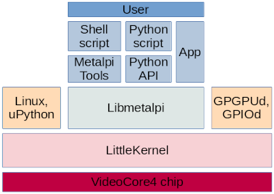

**NOTE: this README is just a draft, the repo is under heavy rework.**

# Raspberry Pi bare metal development platform

Factory Raspberry Pi is defined as "low-cost, high performance, desktop computer" or "personal computer" or "single board computer". With a few exceptions (ie: Compute Module and Pico), it is made to hook a monitor, keyboard and mouse, and give a graphical interface to the users. In time it has been successfully used for many different electronic projects (motion control, radio, lightning) but its use in electronics was limited in software because of the different scope.

The Broadcom silicon is a [VideoCore4 GPU](https://en.wikipedia.org/wiki/VideoCore) made of VPUs (general purpose cores), QPUs (vector cores), and an ARM CPU. Factory firmware focuses on desktop use, giving to the users the chance to load Linux on the ARM cpu and keeping the GPU for maintenance and video output, using a closed source ThreadX operating system running in the background on the VPUs. This setup limits both the real time performance and the general purpose GPU computing (GPGPU). By replacing ThreadX with an open source alternative, users are able to fully exploit RPi hardware, turning any RPi in a "low-cost, high performance, electronics power house": Metal-Pi.

**Metal-Pi** is a bare metal development platform for all Raspberry Pi models. It is an extension of [Kristina Brooks's rpi-open-firmware](https://github.com/christinaa/rpi-open-firmware) and Michael Bishop's followups ([rpi-open-firmware](https://github.com/librerpi/rpi-open-firmware), [LK](https://github.com/librerpi/lk)). It is tailored by developers for developers: headless, using the gpu (ie: 2 VPUs and 12 QPUs) for real time applications and general purpose computing (GPGPU).

This repository is the umbrella project packing all the different parts of the project. The build process produces an example platform but, being 100% open source, any part can be replaced, and the firmware itself can be modified to fit your own needs.

See the [status file](STATUS.md) for more info about current features.

## Quick-start

First you need to install Nix:

`curl -L https://nixos.org/nix/install | sh`

This will create the Nix's store at /nix and setup the command line utility in your path. Then you need to download a copy of this repo

`git clone --recurse-submodules https://github.com/mfp20/metalpi.git`

finally chdir to your local copy of this repo and

`nix-build -f . arm6.bootdir`

This will download and build the toolchain and the firmware. After completion copy `result` folder's contents on the SD card,
move the SD card to your RPi and boot!

For more info about installing and building Metal-Pi see the [install file](INSTALL.md).

## Technical Details

This repository includes [Nix](https://nixos.org/)-based [scripts](nix/) and all the submodules needed to setup the toolchain and build the default distribution.

The build process will download, build and pack a ready to use folder to be copied on your SD card. It will include:
- the [VC4 C library](vc4-lib/) to use VC4 hardware,
- the [VC4 libre firmware](vc4-firmware/) to initialize the VC4 (VPUs, QPUs, ARM, peripherals) and boot the payloads,
- the [VC4 version](vc4-lk/) of [LittleKernel](https://github.com/littlekernel/lk) running on VPU0,
- the [VC4 GPIOd](vc4-gpiod/) running on VPU1,
- the [Metal-Pi C++ helper library](lib/) to use the Metal-Pi platform,
- the [Metal-Pi Linux tools](tools/) linux command line tools,
- the vanilla RPi version of [TinyCore Linux](http://www.tinycorelinux.net/) running headless on the ARM core.

A config file in the output directory (ie: SD card content) is used to tweak the run time options.

## Documentation

Each submodule includes a `docs` folder with its own documentation.

## Credits, license, contacts

Metal-Pi is the result of many people's work. For details see the [authors file](AUTHORS.md).

Our code is under [GPLv2+](LICENSE). Various external projects are mirrored under a mix of GPL-compatible licenses. Broadcom's code is licensed under 3-Clause BSD License.

**Please [contact us](CONTRIBUTING.md) before randomly hacking on the codebase.**
